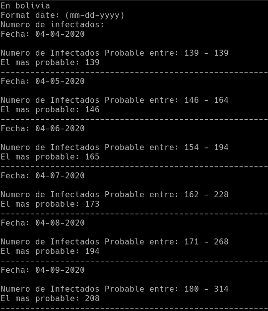

# Covid-19 predictor

Un programa que es capaz de realizar predicciones de la tasa de contagio en los días futuros, el programa puede predecir el maximo y minimo numero de casos que habrá los siguientes 10 días 

Aun existe varios detalles que revisar sobre el modelo, pero ya es capaz de predecir con los datos de los paises en los que se hace el seguimiento de numero de infectados.

Este programa está inspirado en el vídeo [Te Explico POR QUÉ estoy PREOCUPADO | [COVID-19]](https://youtu.be/-PUT0hZiZEw) donde muestra como usando matemáticas puede predecir el número de casos posibles en futuros días, les recomiendo ver el video para entender mejor cómo funciona este programa.

Con este programa podemos evaluar si nuestra situacion esta mejorando o empeorando.

## 1. ¿Como funciona?

### 1.1 Análisis.

Tenemos la expresión *I<sub>n+1</sub> = I<sub>n</sub>\*(EP+1)* 

Donde *I<sub>n</sub>* es el número de infectado
y *I<sub>n+1</sub>* es el número de infectado siguiente

Despejamos la variable *EP* ya que esa es la variable que determina un caso futuro y es la variable de la que vamos a predecir los valores posibles que puede tener los siguientes días, según su comportamiento en los días ya registrados.

Tenemos que:


Vamos a llamar a la variable *EP* Factor de contagio.

Calculando los valores del *Factor de contagio* de los días registrados en Bolivia tenemos las siguente gráfica.


### 1.2 Datos

Los datos los obtenemos mediante esta API https://github.com/mathdroid/covid-19-api

Los datos de los lugares como los Estados Unidos, China y otros paises en el que se detecta por los estados o regiones del pais, fueron sumados para obtener su total pero difieren de otras fuentes.

### 1.3 Entrenamiento de un modelo.
Para predecir que *Factor de contagio* tendremos en los siguientes días usaremos el algoritmo de regresion lineal, en lugar de simplemente entrenar con los datos y ya, decidi entrenar varios modelos de 10 en 10 datos, es decir recorriendo los datos tomando grupos de 10.

```
[[1,2,3,4,5,6,7,8,9,10], 11,12,13,14,15,16,17,...]
[1, [2,3,4,5,6,7,8,9,10,11], 12,13,14,15,16,17,...]
[1,2, [3,4,5,6,7,8,9,10,11,12], 13,14,15,16,17,...]
[1,2,3, [4,5,6,7,8,9,10,11,12,13], 14,15,16,17,...]
[1,2,3,4, [5,6,7,8,9,10,11,12,13,14], 15,16,17,...]
[...]
[1,2,3,4,5,6,7,8,9,10,11,12,13,14,15,16,17, [...]]
```


Obtenemos las siguientes ecuaciones:
- 
- 
- 
- 
...
- 

Usamos los parametros *W* y *b* para obtener tres modelos con estas ecuaciones.

- Mediana: 
- Media: 


### 1.4 Predicción.

Con estos 2 modelos podemos estimar como puede variar el *Factor de contagio* en el futuro.


EL valor del *Factor de contagio* en los siguientes 10 días puede variar entre la media o la mediana.

### 1.5 Predicción del minimo y maximo número de casos probables en el futuro

Para hacer una predicción de ambas situaciones se hizo un calculo iterativo, en este calculo copiamos el modelo para poder rentrenarlo cada vez que predecimos el siguiente *Factor de contagio*

Entonces con el modelo predecimo el siguiente número de ifectados usando la formula antes mensionada *I<sub>n+1</sub> = I<sub>n</sub>\*(EP+1)* y donde *EP* reemplazamos con el *Factor de contagio obtenido*.




## 2. Observaciones

Analizando mejor los datos y el modelo, hay una serie de observaciones que pueden afectar en la predicción.

1. Los datos del número de infectados solo son el numero de infectados que se lograron detectar, por lo que el numero real no se conoce debido a que puede existir muchos infectados asintomáticos, es decir que no presentan síntomas

2. En las predicciones de los paises donde su *factor de contagio* es cero puede tomarse como una situación muy poco probable, debido a la naturaleza del virus y del comportamiento de los ciudadanos el *factor de contagio* aun puede o no aumentar.

3. El crecimiento del infectados no es exponencial, los seres humanos en el mundo no somos infinito por lo que hay otro factor que puede afectar a la probabilidad de contagio, es decir no puedes contagiar a los que ya estan contagiados, en cuanto mas suba el numero de contagiados, el numero de casos por día va a tender a cero, pienso hacer un analisis sobre estas condiciones

## 3. Conclusiones

Con este programa puede predecir los futuros casos observando los datos de numero de contagios diarios acumulado

Se puede concluir que si la pendiente de los modelos de regresión lineal son negativos el *factor de contagio* del país analizado tiende a reducir.

Segun las observaciones el crecimiento del número de infectados es asintótica a la poblacion total de cada país.

## 4. siguientes pasos

- Analizar otros factores que puedan afectar a la predicción,
- Cambiar la predicción de solo predecir los futuros números de infectados y tomar en cuenta los otros datos como los recuperados o los fallecidos.

## 5. Pre-requisitos para correr el script
- numpy          https://numpy.org/
- matplotlib     https://matplotlib.org/
- scipy          https://www.scipy.org/

## 6. Lanzar el programa

El programa esta escrito en Python 3.

Instalando requisitos:
- Ejecute el siguiente comando para instalar los requisitos
```bash
pip install -r requirements.txt
# o 
pip3 install -r requirements.txt
```
Ejecutar el programa:
- Ejecute
```bash
python covid19_predictor.py "pais"
# o
python3 covid19_predictor.py "pais"

```
Donde "pais" es el nombre del país (sin las comillas) del que deseas hacer la predicción.
El nombre del país debe estar en minuscula, la lista de paises esta en el archivo "Countries.txt"

Para actualizar a los datos actuales ejecute:

```bash
python covid19_predictor.py update
# o
python3 covid19_predictor.py update

```


## Autores

* **Willy Samuel Paz Colque** - *Trabajo total*
